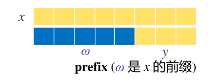
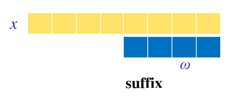
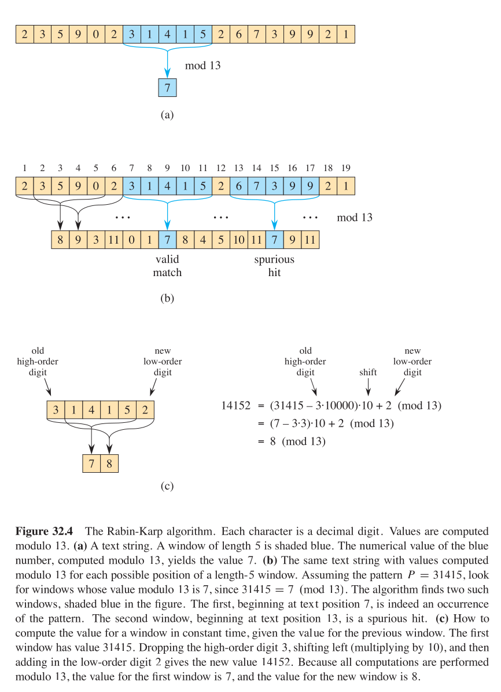
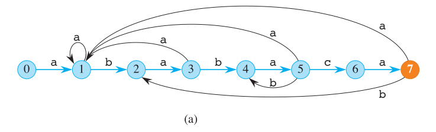

## 字符串匹配问题
1. **文本和模式**：给定一个文本字符串 $ T[1 \ldots n] $ 和一个模式字符串 $ P[1 \ldots m] $，其中 $ m \leq n $。
2. **有限字母表**：字符串由有限字母表 $ \Sigma $ 中的字符组成，例如 $ \Sigma = \{0, 1\} $ 或 $ \Sigma = \{a, b, \ldots, z\} $。
3. **匹配条件**：模式 $ P $ 在文本 $ T $ 中以偏移量 $ s $ 出现，如果 $ 0 \leq s \leq n-m $ 且 $ T[s+1 \ldots s+m] = P[1 \ldots m] $。
4. **有效偏移**：如果 $ P $ 在 $ T $ 中以偏移量 $ s $ 出现，则 $ s $ 是一个有效偏移；否则，$ s $ 是无效偏移。
5. **目标**：找出所有使模式 $ P $ 在文本 $ T $ 中出现的偏移量 $ s $。
## 基本概念
1. **$\Sigma ^{*}$**：由字母表Σ中的字符组成的所有有限长度字符串的集合。
2. **$\epsilon$**：零长度的空字符串，也属于$\Sigma ^{*}$。
3. **$|x|$**：字符串$x$的长度。
4. **字符串连接**：两个字符串$x$和$y$的连接，记作$xy$，其长度为$|x| + |y|$。
5. **$\omega ⊏ x$**：字符串$\omega$是$x$的前缀，如果存在某个$y$属于 $\Sigma ^{*}$，使得$x = \omega y$。
  

6. **$\omega ⊐ x$**：$\omega$ 是$x$的后缀，如果存在某个$y$属于$\Sigma ^{*}$，使得 $x = y \omega$。

  - 如果$\omega ⊏ x$或$\omega ⊐ x$，则$|\omega| \leq |x|$。
  - 空字符串$\epsilon$是每个字符串的后缀和前缀。
  - 例如：前缀，$ab ⊏ abcac$；后缀，$cca ⊐ abcca$。
  - 对于任何字符串 $x$ 和 $y$ 以及任意字符 $a$，我们有 $x ⊐ y$ 当且仅当 $xa ⊐ ya$。
  - $⊏ $和$ ⊐ $是传递关系。

  

## 朴素字符串匹配算法
很容易想到的一种方法就是在文本中滑动模板，滑动过程中比较是否匹配，时间复杂度$O(mn)$
```plaintext
NAIVE-STRING-MATCHER(T, P, n, m)
1  for s = 0 to n - m
2      if P[1:m] == T[s + 1:s + m]
3          print "Pattern occurs with shift" s
```

## Rabin-Karp 算法

我们可以将每一个字符进行编码，之后按位求和，得到每一个字符串的一个值，利用Hash和尖端数论的方法，我们可以知道每个字符串只对应一个数字。之后只需要找到字符串里数字相等的字符串即可。这种方式的预处理时间复杂度为$O(m)$运行时间复杂度为$O(mn)$


虽然他的时间复杂度仍然是$O(mn)$，我们可以借鉴这种对字符串的预处理方法，于是我们就有两种方法：有限状态机和KMP算法

| Algorithm            | Preprocessing time | Matching time         |
|----------------------|--------------------|-----------------------|
| Naive                | 0                  | $O((n - m + 1)m)$    |
| Rabin-Karp            | $\Theta(m)$       | $O((n - m + 1)m)$    |
| Finite automaton      | $O(m\|\Sigma\|)$  | $\Theta(n)$         |
| Knuth-Morris-Pratt    | $\Theta(m)$       | $\Theta(n)$         |
## 有限状态机
有限自动机（Finite Automaton，简称FA）是一种数学模型，用于描述计算过程。它由以下五个部分组成：

1. **状态集合$Q$**：一组有限的状态。
2. **初始状态$q_0$**：状态集合中的一个特定状态，作为自动机的起点。
3. **接受状态集合$A$**：状态集合的一个子集，表示成功完成计算的状态。
4. **输入字母表$\Sigma$**：一组有限的输入符号。
5. **转移函数$\delta$**：定义了在给定当前状态和输入符号的情况下，自动机如何转移到下一个状态的函数。

有限自动机通过读取输入符号序列，并根据转移函数在状态之间移动，来决定输入序列是否被接受。如果最终状态是接受状态，则输入被接受；否则，被拒绝。

以模板字符串`ababaca`为例，他的状态转移图如下

对于需要匹配的字符串，我们只需要从$1$到$n$进行遍历，对于输入字符串进行状态转移，当到达状态$7$时即可认为匹配成功
```plaintext
FINITE-AUTOMATON-MATCHER(T, δ, n, m)
1   q = 0
2   for i = 1 to n
3       q = δ(q, T[i])
4       if q == m
5           print “Pattern occurs with shift” i - m
```
那么现在的问题是，我们如何构建这样一个状态机以及状态转移函数

考虑以下两种情况。

第一种情况是，$ a = P[q + 1] $，使得字符 $ a $ 继续匹配模式。在这种情况下，由于 $ \delta(q, a) = q + 1 $，转换沿着自动机的“主线”继续进行。

第二种情况，$ a \neq P[q + 1] $，使得字符 $ a $ 不能继续匹配模式。这时我们必须找到一个更小的子串，它是 $ P $ 的前缀同时也是 $ T_i $ 的后缀。因为当创建字符串匹配自动机时，预处理匹配模式和自己，转移函数很快就得出最长的这样的较小 $ P $ 前缀。

于是我们就可以写出匹配的伪代码

```plaintext
COMPUTE-TRANSITION-FUNCTION(P, Σ, m)
1  for q = 0 to m
2      for each character a ∈ Σ
3          k = min {m, q + 1}
4          while P[:k] is not a suffix of P[:q]a
5              k = k - 1
6          δ(q, a) = k
7  return δ
```
可以看到对于每个属于$\Sigma$的字符都对应一个状态，我们同样以字符串`ababaca`为例，$\Sigma = {a,b,c}$
| state | input |      |      | P    |  
|-------|-------|------|------|------|
|       | a     | b    | c    |      |    
| 0     | 1     | 0    | 0    | a    |
| 1     | 1     | 2    | 0    | b    |
| 2     | 3     | 0    | 0    | a    |
| 3     | 1     | 4    | 0    | b    |
| 4     | 5     | 0    | 0    | a    |
| 5     | 1     | 4    | 6    | c    |
| 6     | 7     | 0    | 0    | a    |
| 7     | 1     | 2    | 0    | a    |

## KMP算法
可以借鉴有限状态机的思路，但是不考虑下一个输入的状态而是考虑怎么将已经有的字符串移位。

也是考虑以下两种情况

KMP（Knuth-Morris-Pratt）字符串匹配算法中的状态转移机制可以总结为以下两种情况：

第一种情况:当当前字符 $ T[s + 1] $ 与模式串 $ P $ 中下一个字符 $ P[q + 1] $ 相等，匹配可以继续进行。

第二种情况：匹配失败，当当前字符 $ T[s + 1] $ 与模式串 $ P $ 中下一个字符 $ P[q + 1] $ 不相等，即 $ T[s + 1]  \neq P[q + 1] $。在这种情况下，匹配失败，需要找到一个更小的子串，这个子串既是 $ P $ 的前缀也是 $ T_i $ 的后缀。这通过查找最长的相同后缀来实现，这个后缀是 $ P $ 的前缀。这种状态转移允许算法利用已经匹配的部分信息，避免从头开始匹配，从而提高匹配效率。

也就是我们需要找到$P[q]$的最长后缀将字符串后移,于是我们需要知道知道后移后那些字符已经匹配好，即需要得到数组$\pi$

### 前缀函数计算朴素算法
直接通过循环来计算数组
```C++
// 注：
// string substr (size_t pos = 0, size_t len = npos) const;
vector<int> prefix_function(string s) {
  int n = (int)s.length();
  vector<int> pi(n);
  for (int i = 1; i < n; i++)
    for (int j = i; j >= 0; j--)
      if (s.substr(0, j) == s.substr(i - j + 1, j)) {
        pi[i] = j;
        break;
      }
  return pi;
}
```
显然该算法的时间复杂度为$O(n^3)$

### 计算前缀函数的高效算法
可以观察到相邻的前缀函数值至多增加1,于是可以的到下面的优化
```C++
vector<int> prefix_function(string s) {
  int n = (int)s.length();
  vector<int> pi(n);
  for (int i = 1; i < n; i++)
    for (int j = pi[i - 1] + 1; j >= 0; j--)  // improved: j=i => j=pi[i-1]+1
      if (s.substr(0, j) == s.substr(i - j + 1, j)) {
        pi[i] = j;
        break;
      }
  return pi;
}
```
我们已经考虑了如果前缀和后缀增加的字符相同的情况，如果增加的字符不同时怎么优化呢？

我们可以寻找$T[:\pi[i]]$和$T[i-j+1:i]$寻找其中是否还有比这个公共前后缀短的前后缀，看这个较短的前后缀是否可以匹配。
```C++
vector<int> prefix_function(string s) {
  int n = (int)s.length();
  vector<int> pi(n);
  for (int i = 1; i < n; i++) {
    int j = pi[i - 1];
    while (j > 0 && s[i] != s[j]) j = pi[j - 1];
    if (s[i] == s[j]) j++;
    pi[i] = j;
  }
  return pi;
}
```
我们就得到了优化后求公共前后缀的函数，就可以匹配两个字符串了
```C++
#include <iostream>
#include <vector>
#include <string>
using namespace std;

// 构建前缀函数（next数组）
vector<int> prefix_function(string s) {
    int n = (int)s.length();
    vector<int> pi(n);
    for (int i = 1; i < n; i++) {
        int j = pi[i - 1];
        while (j > 0 && s[i] != s[j]) j = pi[j - 1];
        if (s[i] == s[j]) j++;
        pi[i] = j;
    }
    return pi;
}

// KMP字符串匹配，返回所有匹配位置
vector<int> kmp_search(string text, string pattern) {
    string s = pattern + "#" + text;  // 拼接字符串
    vector<int> pi = prefix_function(s);
    
    vector<int> result;
    int m = pattern.length();
    
    for (int i = m + 1; i < (int)s.length(); i++) {
        if (pi[i] == m) {
            result.push_back(i - 2 * m);  // 计算在原text中的位置
        }
    }
    return result;
}

// 另一种写法：不拼接字符串
vector<int> kmp_search_v2(string text, string pattern) {
    vector<int> pi = prefix_function(pattern);
    vector<int> result;
    
    int n = text.length();
    int m = pattern.length();
    int j = 0;
    
    for (int i = 0; i < n; i++) {
        while (j > 0 && text[i] != pattern[j]) {
            j = pi[j - 1];
        }
        if (text[i] == pattern[j]) {
            j++;
        }
        if (j == m) {
            result.push_back(i - m + 1);
            j = pi[j - 1];
        }
    }
    return result;
}

int main() {
    string text = "ABABCABABA";
    string pattern = "ABA";
    
    // 方法1：拼接字符串
    vector<int> positions = kmp_search(text, pattern);
    cout << "文本: " << text << endl;
    cout << "模式: " << pattern << endl;
    cout << "匹配位置: ";
    for (int pos : positions) {
        cout << pos << " ";
    }
    cout << endl;
    
    // 方法2：不拼接字符串
    vector<int> positions2 = kmp_search_v2(text, pattern);
    cout << "匹配位置(方法2): ";
    for (int pos : positions2) {
        cout << pos << " ";
    }
    cout << endl;
    
    // 显示前缀数组
    vector<int> pi = prefix_function(pattern);
    cout << "\n前缀数组: ";
    for (int x : pi) {
        cout << x << " ";
    }
    cout << endl;
    
    return 0;
}
```


