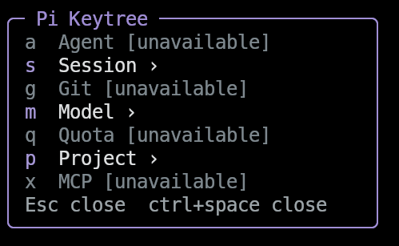

## Overview

As a coding-agent setup grows, remembering every slash command and extension shortcut becomes harder. **Pi Keytree** makes those commands discoverable through a small, hierarchical menu: press **Ctrl+Space**, choose a category, then choose an action.

Inspired by Neovim, LazyVim, and which-key-style command discovery, it brings a familiar leader-key workflow to Pi. It is an independent project—not an official integration with those tools—and focuses on command navigation rather than Vim-style text editing.

## Features

- **One navigable command tree:** Group agent, session, Git, model, quota, project, and MCP actions into configurable categories.
- **Compact terminal UI:** A right-side bordered overlay updates in place as you enter submenus, with scrolling, responsive sizing, and optional Nerd Font icons.
- **Context-aware actions:** Missing extension commands are dimmed or hidden, and Git actions are disabled outside a repository.
- **Draft preservation:** The existing editor stays intact. Commands that need confirmation are prepared only in an empty editor and require Enter; existing drafts are never overwritten.
- **Safe project inspection:** Read project configuration and `AGENTS.md` without editing files, or select a Git base branch for comparison without fetching or mutating the repository.
- **Configurable behavior:** Customize the menu, model presets, panel width, icons, and timeout through JSON. A timeout of `0` keeps the menu open until dismissed.

## Design

Pi Keytree uses Pi's public extension and terminal UI APIs without patching the core or replacing its editor, header, or footer. Pi supplies the host libraries, so the extension adds no runtime dependencies.

The overlay temporarily takes keyboard focus so menu keys do not leak into a draft. Closing it restores the previous focus. Ordinary Space remains untouched, and `/keytree` provides a fallback when a terminal or desktop intercepts Ctrl+Space.

Optional integrations are detected through registered commands rather than imported as dependencies. These include **pi-subagents**, **pi-diff-review**, **pi-spark**, **@latentminds/pi-quotas**, and **pi-mcp-adapter**. Unavailable actions are never sent to the model as ordinary prompts, and agent shortcuts prepare a command template rather than launching work without a task.

## Quick Start

Install the published package:

```bash
pi install npm:pi-keytree
```

Press **Ctrl+Space** or run `/keytree` to open the menu. Keys are pressed sequentially:

| Keys | Action |
|---|---|
| Ctrl+Space → `g` → `d` | Open a Git diff through pi-diff-review |
| Ctrl+Space → `s` → `n` | Prepare `/new` for confirmation |
| Ctrl+Space → `m` → `m` | Prepare `/model` for confirmation |
| Ctrl+Space → `p` → `a` | Open the read-only `AGENTS.md` viewer |

Use **Backspace** or **Left Arrow** to return to a parent menu, and **Esc** to close it. No configuration file is required to use the default tree.

## Compatibility

The documented host requirement is **Pi 1.0.0**; later releases have not yet been verified. Some shortcuts depend on optional extensions, and Ctrl+Space support depends on terminal keyboard encoding. Built-in UI commands that cannot be executed through a public API are prepared for explicit confirmation instead.

The project is open source under the **MIT license**. See the [repository](https://github.com/haoyuehx/pi-keytree) for configuration details, integration behavior, and development instructions.
