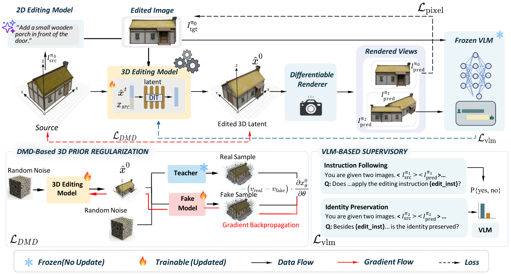

**Learning 3D Editing without Paired Supervision via Generative Prior Distillation**  
Hao Wen, Weibin Yun, Hongxing Fan, Haotian Lu, Rui Chen, Zehuan Huang, Lu Sheng  
*SIGGRAPH Asia 2026 Conference Papers*


## Overview

High-quality paired examples of source and edited 3D assets are scarce. Existing approaches either optimize each asset at test time, which is slow, or train on synthetic 3D pairs, which may introduce structural drift and geometric artifacts.

**PriorEdit3D** is a feed-forward 3D editing framework that needs no paired 3D supervision, test-time inversion, or manually defined 3D mask. Its central idea is **Generative Prior Distillation**: instead of learning from target 3D assets, the editor distills visual, semantic, and geometric knowledge from pretrained foundation models.

Given a source 3D asset and a natural-language instruction, PriorEdit3D supports local edits such as part addition, removal, replacement, and color changes, as well as global changes to pose, texture, and style. An edit takes approximately **7 seconds** on a single A100 GPU.

## Method



PriorEdit3D builds on the unified 3D latent space of UniLat3D. A differentiable renderer carries supervision from foundation models back to the 3D editor. Three complementary priors address edit fidelity, instruction following, and geometric plausibility.

### 2D visual prior

At the primary editing view, a 2D image-editing model generates a target image from the source view and instruction. The edited 3D latent is rendered and matched to that image using foreground pixel, opacity, and perceptual feature losses. These signals provide detailed supervision for the requested edit.

### VLM semantic prior

Single-view pixel losses cannot guarantee that the result looks correct from the side or back. We therefore render novel views and ask a frozen vision-language model two complementary questions:

- **Instruction Following:** Is the requested edit present from a novel viewpoint?
- **Identity Preservation:** Does the object retain its identity and structure outside the edited region?

Gradients flow through the VLM's image inputs and the differentiable renderer, updating the 3D editor while the VLM remains frozen. This improves semantic consistency across views.

### 3D geometric prior

Supervision on 2D projections alone can still lead to geometric collapse, structural drift, or inconsistent views. We use 3D-aware Distribution Matching Distillation (DMD) with a frozen pretrained UniLat3D teacher to keep edited latents close to the manifold of realistic 3D assets.

A second, trainable "fake" model estimates the student's own distribution. Comparing the teacher and fake velocity fields provides a distribution-matching signal without simply pulling every result toward the teacher and risking mode collapse.

## Data

Training relies on 2D edit supervision rather than paired source and target 3D assets:

1. Render canonical views of **73,451** Objaverse assets.
2. Generate editing instructions with Gemini 3 Flash.
3. Produce edited 2D images with Qwen-Image-Edit-2511-Lightning.
4. Filter failed, implausible, cropped, background-damaging, or ineffective edits using Qwen3-VL and SSIM.

The curated dataset contains **73,121** editing instances and **150,482** annotated operations. It spans local additions, removals, replacements, shape and color changes, plus global pose, texture, and style edits.

## Results

PriorEdit3D performs strongly across edited-image alignment, overall 3D quality, condition alignment, and identity preservation while reducing the time needed for each edit.

| Method | PSNR ↑ | SSIM ↑ | FID ↓ | CLIP-T ↑ | LLM-Id ↑ | LLM-Inst ↑ | Runtime ↓ |
|---|---:|---:|---:|---:|---:|---:|---:|
| 3DEditFormer | 18.89 | 0.89 | 167.85 | 0.28 | 86.31 | 53.39 | 74 s |
| VoxHammer | 16.87 | 0.87 | 179.22 | 0.27 | 76.54 | 51.74 | 133 s |
| Nano3D | 19.90 | 0.91 | 103.50 | 0.21 | 85.35 | 60.37 | 14 s |
| **PriorEdit3D** | **24.37** | **0.94** | **71.96** | **0.31** | **93.13** | **86.92** | **7 s** |

Evaluation on the out-of-distribution ABO and GSO datasets also shows promising generalization. Ablations indicate that the three signals are complementary: pixel losses preserve details in the editing view, VLM feedback strengthens instruction alignment in novel views, and DMD improves geometric quality and cross-view stability.

## Limitations

The method still struggles with fine details such as precise text and dense small objects. Unedited regions can exhibit some texture or geometry drift. Errors from the 2D editing teacher may propagate to the 3D result, while the UniLat3D prior makes large pose or topology changes challenging.

## Citation

```bibtex
@article{wen2026prioredit3d,
  title   = {Learning 3D Editing without Paired Supervision via Generative Prior Distillation},
  author  = {Wen, Hao and Yun, Weibin and Fan, Hongxing and Lu, Haotian and Chen, Rui and Huang, Zehuan and Sheng, Lu},
  journal = {ACM Transactions on Graphics},
  year    = {2026}
}
```
